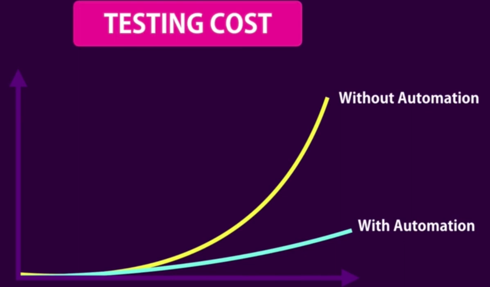

# Introduction to Software Testing

<!-- TOC -->

- [Introduction to Software Testing](#introduction-to-software-testing)
    - [Manual vs automated](#manual-vs-automated)
    - [Type of tests](#type-of-tests)
    - [Testing pyramid](#testing-pyramid)

<!-- /TOC -->

## Manual vs automated

| Manual Testing              | Automated Testing        |
| --------------------------- | ------------------------ |
| Needs a human               | Authomated               |
| Takes time                  | Less Time                |
| Repeat for each new feature | Refactor with confidence |
| Doesn't help with code      | Write a better code      |

    &emsp;
    

## Type of tests

-   Unit testing
-   Integration testing
-   E2E testing

## Testing pyramid

    &emsp;
    

